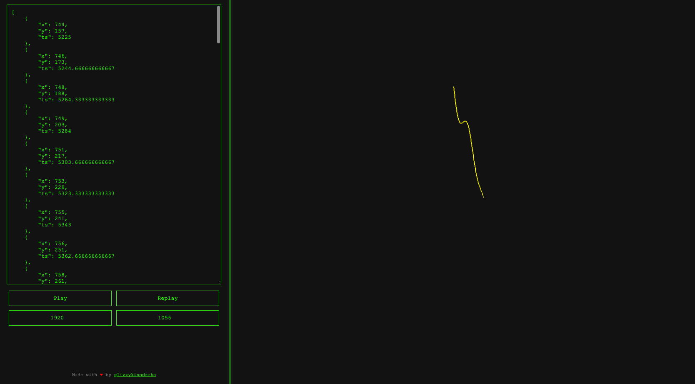

# Datadome Movements Display

[Live Demo](https://datadome-movements-display.vercel.app/) | [Codepen](https://codepen.io/glizzykingdreko/pen/YzMPxpM) | [Buy me a coffee](https://www.buymeacoffee.com/glizzykingdreko)

## Table of Contents
- [Datadome Movements Display](#datadome-movements-display)
  - [Table of Contents](#table-of-contents)
  - [Description](#description)
  - [Features](#features)
  - [Getting Started](#getting-started)
    - [Prerequisites](#prerequisites)
    - [Installation](#installation)
  - [Deployment](#deployment)
  - [Contributing](#contributing)
  - [License](#license)
  - [Contact](#contact)

## Description

This project aims to help display the stored Datadome movements for the GeeTest Slide captcha. It visualizes movements captured during interaction with the captcha, rendering them in a scalable, shareable format. The input format is identical to the one used by Datadome, which is a list of JSON objects in the following format:

```json
[{"x": 12, "y": 22, "ts": 213}, ...]
```
This tool is designed to assist developers and analysts in understanding user interaction patterns with captchas, potentially aiding in the development of more intuitive and secure captcha solutions. (lmao is to help u solving it)

## Features

- **Interactive Visualization**: Allows for the interactive display of Datadome movement data, providing a visual representation of user interactions with GeeTest Slide captcha.
- **Base64 URL Sharing**: Implements Base64 encoding for movement data and window size settings, facilitating the creation of shareable URLs that encapsulate the visualization state for easy sharing and collaboration.
- **Responsive Layout**: Features a responsive design that adjusts the layout dynamically based on the screen size, ensuring optimal usability across devices, from desktops to mobile phones.
- **Data Persistence**: Utilizes `localStorage` to save the latest input JSON and window size preferences, ensuring that users can pick up where they left off in subsequent sessions.

## Getting Started

To get a local copy up and running follow these simple steps.

### Prerequisites

This project requires Node.js and npm installed on your system. You can download and install them from [nodejs.org](https://nodejs.org/).

### Installation

1. Clone the repo
   ```bash
   git clone https://your-repository-link-here.git
   ```
2. Install NPM packages
   ```
   npm install
   ```
3. Start the application
    ```
    npm start
    ```

This will start the server, and you can view the application by navigating to http://localhost:3000 in your web browser.

## Deployment

This application is deployed on Vercel, providing a seamless and scalable hosting solution. To view the live application, visit [Datadome Movements Display on Vercel](https://datadome-movements-display.vercel.app/). The deployment on Vercel ensures that the application is accessible worldwide with minimal latency.

For those interested in deploying their own version or contributing to the project, Vercel offers an intuitive deployment process that integrates directly with your GitHub repository. Simply connect your GitHub account to Vercel and select the repository you wish to deploy.

Additionally, for a quick look at some of the functionalities and code snippets, check out our [CodePen](https://codepen.io/glizzykingdreko/pen/YzMPxpM).

## Contributing

Contributions to Datadome Movements Display are very welcome! Whether it's reporting bugs, suggesting new features, or contributing code, your input is valuable and appreciated.

1. Fork the Project repository.
2. Create your Feature Branch (`git checkout -b feature/YourAmazingFeature`).
3. Commit your Changes (`git commit -m 'Add some YourAmazingFeature'`).
4. Push to the Branch (`git push origin feature/YourAmazingFeature`).
5. Open a Pull Request to the `main` branch.

## License

This project is licensed under the MIT License - see the [LICENSE](LICENSE.md) file for details. This license allows for maximum flexibility in the use and distribution of the project's code.

## Contact

For any inquiries or further information, please reach out:

- Project Maintainer: [glizzykingdreko](mailto:glizzykingdreko@protonmail.com)
- Twitter: [@glizzykingdreko](https://twitter.com/glizzykingdreko)
- GitHub Project Link: [here](https://github.com/glizzykingdreko/datadome-movements-display)
- Codepen Project URL: [here](https://codepen.io/glizzykingdreko/pen/YzMPxpM)
- You like my projects? [Buy me a coffee](https://www.buymeacoffee.com/glizzykingdreko)

Feel free to contact for collaborations, questions, or feedback regarding the project.

Need help solving Datadome? [Contact me](mailto:glizzykingdreko@protonmail.com)